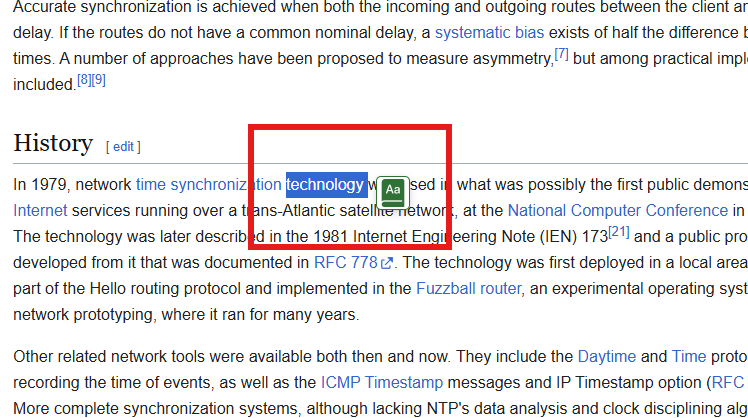
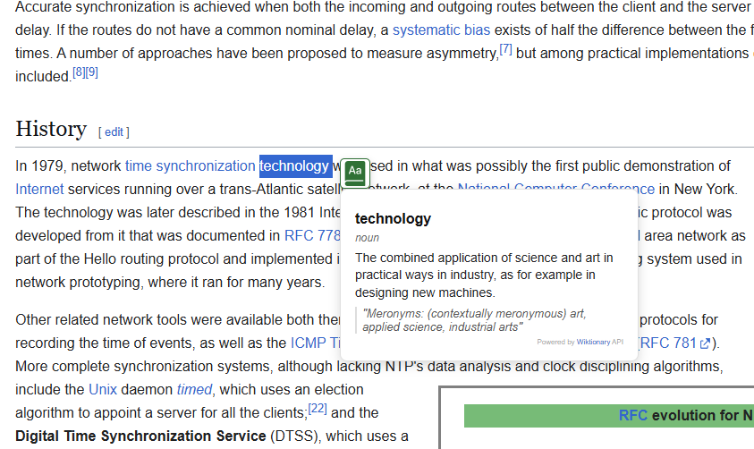

# Pocket Dictionary

Pocket Dictionary is a lightweight Chrome extension that lets you look up word meanings directly from any web page. Highlight a word, click the pop-up button, and get a clean definition overlay without leaving the page.

> Note: It is not published in the Chrome Web Store, so it must be installed manually.

## Manual installation

To install the extension in Google Chrome or another Chromium-based browser:

1. Open the browser and go to `chrome://extensions`.
2. Enable `Developer mode` in the top-right corner.
3. Click `Load unpacked`.
4. Select the `pocket-dictionary` project folder.
5. The extension should now appear in your toolbar.

> Note: If you later update the files, return to `chrome://extensions` and click the reload button for `Pocket Dictionary`.

## How it works

1. Open any webpage.
2. Select a word using your mouse or keyboard.
3. A small dictionary button appears near the selection.
4. Click the button to view the definition, part of speech, and example usage.

### Screenshots

- Screenshot 1: Highlighted word with dictionary button
  

- Screenshot 2: Definition pop-up overlay
  

> Replace the placeholder image paths above with your actual screenshots.

## Notes

- The extension uses a public dictionary API to fetch meanings for selected words.
- The UI is intentionally simple and designed to stay out of your way while browsing.
